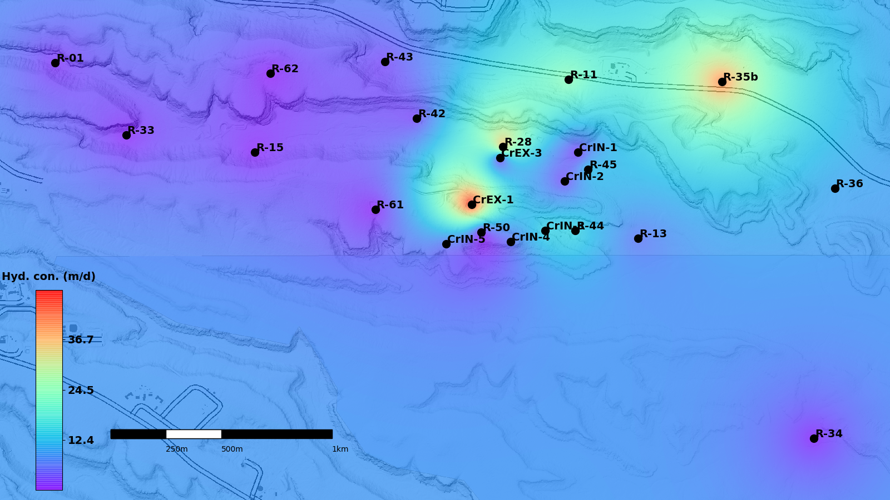

CrPlots.jl
================

CrPlots.jl is a [ZEM](https://gitlab.com/zem) module.
The modeule can be applied to create an empty plot with the background image without data; or plot data using linear interpolation, kriging, or inverse weighted distance; or plot matrix data. The following plot is generated using this module:

The module include the following functions:

CrPlots.addcbar
-----------
Add a colorbar to the plot.

CrPlots.addmeter
-----------
Add a length meter to the plot.

CrPlots.addpbar
-----------
Add a progress bar to the plot.

CrPlots.addpoints
-----------
Add points to the plot.

CrPlots.addwells
-----------
Add well points and names to the plot.

CrPlots.crplot
-----------
- Plot data using linear interpolation.

      function crplot(boundingbox, xs::Vector, ys::Vector, plotdata::Vector; upperlimit=false, lowerlimit=false, cmap=rainbow, figax=false)

- Plot data using kriging.

      function crplot(boundingbox, xs::Vector, ys::Vector, plotdata::Vector, cov; upperlimit=false, lowerlimit=false, cmap=rainbow, pretransform=x->x, posttransform=x->x, figax=false)

- Plot data using inverse weighted distance.

      function crplot(boundingbox, xs::Vector, ys::Vector, plotdata::Vector, pow::Number; upperlimit=false, lowerlimit=false, cmap=rainbow, pretransform=x->x, posttransform=x->x, figax=false)

- Create an empty plot with the background image, but no data.

      function crplot(boundingbox)

- Plot matrix data.

      function crplot(boundingbox, gridcr::Matrix; upperlimit=false, lowerlimit=false, cmap=rainbow, figax=false)
